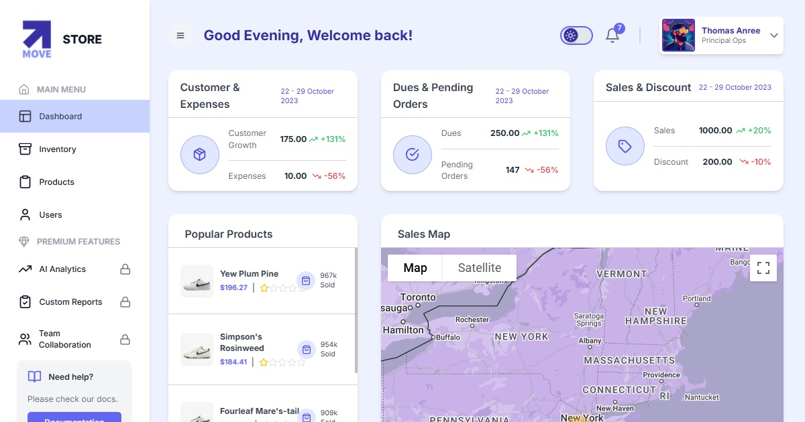

# MOVE App, sample in Next.js of a functional Dashboard


##  Description of the project

This project is a sample of a functional dashboard designed to manage inventory efficiently. It includes the following features:
 
- **Inventory Management:** Tools to add, update, and delete inventory items with Prisma and PostgresSQL.
- **Real-time Analytics:** Charts and metrics for monitoring inventory levels and trends with Material UI.
- **Search and Filters:** Advanced search and filter options for quick item lookup in react with Debounce Pattern.
- **Responsive Design:** Optimized for desktop and mobile devices with Tailwindcss. 
- **Pro upgrade page:** A sample page to upgrade to pro version with tailwindcss.

This dashboard is built using Next.js, a robust React framework with Node.js in Typescript language, ensuring high performance, scalability, and ease of deployment.
 
## Tech Stack used in the project

- **Next JS 14 with App router**
- **Tailwind**
- **Redux Toolkit**
- **Redux Toolkit Query**
- **Material UI Data Grid**
- **Node.js**
- **Jest**
- **Docker**
- **docker-compose**
- **Prisma**

## Resources and Links

- [Prisma schema visualization](https://prisma-editor.vercel.app/schema/12335?token=cm5fh8t6h0000hihvjpk2pvve)

## How to run the project

### Server in local

```bash
npm install 
```

Complete the environment variables in the .env file . See the .env.example file for reference.
 
Start the db with docker compose 
```bash
cd server
docker-compose up -d
```
And the API server is running in the port 3001!

### Client in local

```bash
npm install 
```
Complete the environment variables in the .env.local file . See the .env.local.example file for reference.

Start the client
```bash
cd client
docker-compose up -d
```
And the client is running in the port 3000!

### Client in development

```bash
npm install 
```
Complete the environment variables in the .env.local file . See the .env.local.example file for reference.

Start the client
```bash
npm run dev
```
And the client is running in the port 3000!